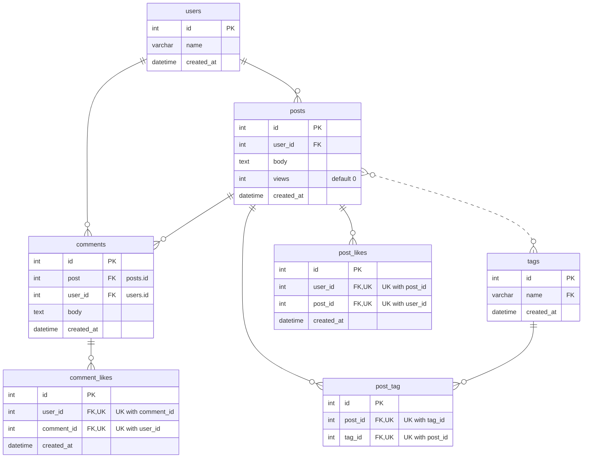

# db-demo

## Prerequisite

- docker (DockerDesktop Or Orbstack)
- [poetry](https://python-poetry.org/docs/#installation)
- [mysqldb](https://github.com/PyMySQL/mysqlclient/blob/main/README.md)

## Models ERD

